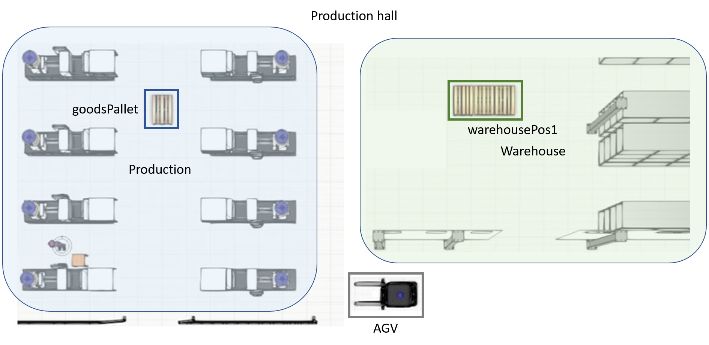

# Logistic Task Language

The Logistic Task Language *(LoTLan)* is a simple, but powerful approach to describe intralogistic materialflow logic. A materialflow process is mainly a transportation task like the pickup *- go to position and get item -* and the delivery *- got to position and unload item*.

## Table of contents

- [Logistic Task Language](#logistic-task-language)
  - [Introduction](#introduction)
    - [Use of Example](#use-of-example)
  - [Primitives](#primitives)
  - [Instances](#instances)
  - [TransportOrderSteps](#transportordersteps)
  - [Tasks](#tasks)
    - [Example Simple Task](#example-simple-task)
    - [Example TriggeredBy Task](#example-trigger-task)
    - [Example OnDone Task](#example-ondone-task)
  - [Comments](#comments)
  - [Full Example](#full-example)
  - [Execution](#execution)

___

## Introduction

The *LoTLan* consists of 4 different building blocks, that combined with each other describes such a process:

- Primitives
- Instances
- TransportOrderSteps
- Tasks

A *Primitive* is an abstract model for a series of similar objects. It is the blueprint for the representation of real objects in software objects and describes attributes (properties) of the objects. Through the instantiation of such a *Primitive* a *Instance* of a concrete object is created. The *TransportOrderStep* with the help of these *Instances* describes a short procedure. A *Task* then combines *Instances* and *TransportOrderSteps* to a enlarged logical process flow.

### Use of Example

The following documentation of *LoTLan* utilizes the example of a production hall that has an area for storing goods *- the Warehouse -* and an area for the manufacturing *- the Production*. To reduce the complexity only one AGV out of a possible lager fleet is used.

<div style="text-align:center">


*Figure 1: Example floor plan with AGV and production & warehouse area*
</div>

This example shown in the figure above will be expanded in the course of time to explain the individual building blocks of the *LoTLan*.

## Primitives

A *Primitive* can contain multiple member variables, like pallets/storage places, multiple conveyer belts, or like sensors with the same capabilities. Therefore, a *Primitive* summarizes and specifies a set of *Instances*.

In the domain of logistics such a *Primitive* could be a location. Defining such a location is done via the *__template syntax__*:

```text
template Location
    type = ""
    name = ""
end
```

The *Primitive* *Location* has two member variables, a *type* and a *value*. These attributes can be later on accessed inside the instances.

The *Primitives* *Event* and *Time* could be defined as following:

```text
template Event
    name = ""
    type = ""
end

template Time
    timing = ""
end
```

**Syntax**: It is important that the attributes inside an *template - end* definition begin with a lowercase character. The name has to start with an uppercase character. Each attribute also needs to be prefixed with four spaces (or a `\t`). Currently only the following 3 attributes are allowed: `name`, `type`, `timing`

## Instances

An *Instance* is the concrete object of a previously declared *Primitive*. Such set of *Instances* do not share any data other than the definition of their attributes.

As an example, two *Instances* of locations could be initiated out of the previously made *Primitive* (see [Primitives section](#Primitives)):

```text
Location goodsPallet
    type = "pallet"
    name = "productionArea_palletPlace"
end

Location warehousePos1
    type = "pallet"
    name = "warehouseArea_pos1"
end
```

The *Instance* *goodsPallet* has two member variables, a *type* and a *value*. The *type* attribute states *what item is located there* and the *value* the *logical name of this location*.

The *Instances* *Event* and *Time* could be defined as following:

```text
Event agvLoadedAtGoodsPallet
    type = "Boolean"
    name = "LightBarrier"
end

Event agvLoadedAtWarehousePos1
    type = "Boolean"
    name = "LightBarrier"
end

Time lunchBreak
    timing = "30 12 * * *"  # Cron format
end
```

**Syntax**: The syntax of *Primitives* introduced here is complemented by assigning values to the attributes. These values must be enclosed by `"`. The name has to start with a lowercase character. Each attribute also needs to be prefixed with four spaces (or a `\t`).

Speaking of the example introduced in the [introduction](#Logistic-Task-Language), the formerly shown *Location* *Instances* each define a specific location inside the two areas.

<div style="text-align:center">



*Figure 2: Floor plan with Locations **goodsPallet** and **warehousePos1***
</div>

The figure shows those locations inside the two areas *Warehouse* and *Production*.

## TransportOrderSteps

A *TransportOrderStep* is a *Task*-fragment that contains only a Location and optionally a TriggeredBy, FinishedBy or OnDone statement. It can be used by a *Task* as a from/to value.

```text
TransportOrderStep {name}
    Location {location_0}
    TriggeredBy {none|event|time}
    OnDone      {none|followUpTask}
    FinishedBy  {none|event|time}
end
```

As an example, two *TransportOrderSteps* are created, both describing a short process:

```text
TransportOrderStep loadGoodsPallet
    Location    goodsPallet
    FinishedBy  agvLoadedAtGoodsPallet == True
end

TransportOrderStep unloadGoodsPallet
    Location    warehousePos1
    FinishedBy  agvLoadedAtWarehousePos1 == False
end
```

The *TransportOrderStep* *loadGoodsPallet* defines picking up from the *Location* *goodsPallet*, which is finished when the *Event* *agvLoadedAtGoodsPallet* is True. For the the optional statements TriggeredBy, FinishedBy and OnDone see [Tasks section](#Tasks).

**Syntax**: It is important that the values inside an *TransportOrderStep - end* definition begin with a lowercase character. Each value also needs to be prefixed with four spaces (or a `\t`). The name has to start with an lowercase character. Currently only the following 3 attributes are allowed: `Location`, `TriggeredBy`, `FinishedBy`, `OnDone`

## Tasks

A *Task* orchestrates different *Instances* via operations to result in a logical process flow. Such a *Task* does not need to describe who is going to transport an item - it is important that the item will be transported.

Generally speaking a *Task* in *LoTLan* describes that a amount of items should be picked up at some location\*s and be delivered to an\*other location\*s. The *Task* can optionally be triggered by an event or by time, can optionally issue a follow up *Task*, can optionally be finished by an event and can optionally be repeated:

```text
Task {name}
    Transport
    From        {transportOrderStep_0}
    To          {transportOrderStep_D}
    TriggeredBy {none|event|time}
    OnDone      {none|followUpTask}
    FinishedBy  {none|event|time}
    Repeat      {none = once|1, ..., n|0 = forever}
end
```

To simplify this down in the following the simplest structure of a *Task* is build and later on extended with optional functionality.

### Example Simple Task

In the simplest form a *Task* in *LoTLan* just describes that an item should be picked up at some location and be delivered to another location:

```text
Task TransportGoodsPallet
    Transport
    From        loadGoodsPallet
    To          unloadGoodsPallet
end
```

In terms of the introduced example production hall this *Task* looks like depicted in the following figure.

<div style="text-align:center">


*Figure 3: Floor plan with Task **TransportGoodsPallet***
</div>

This *Task* *TransportGoodsPallet* could be done by an AGV, that picks up a pallet **from** *goodsPallet* inside the production area and delivers it **to** the *warehousePos1* in the warehouse area.

### Example TriggeredBy Task

A *Task* can be extended with a *TriggeredBy* statement that activates that *Task* if the case occurs. This statement can be an event like a button press or be something simple as a specific time:

```text

Event buttonPallet
    name = "A_Unique_Name_for_a_Button"
    type = "Boolean"
end

Task TransportGoodsPallet_2
    Transport
    From        loadGoodsPallet
    To          unloadGoodsPallet
    TriggeredBy buttonPallet == True
end
```

In this example, the *Task* *TransportGoodsPallet_2* will be triggered by the event if the value is equal (*== True*).

In terms of the introduced example production hall this *Task* looks like depicted in the following figure.

<div style="text-align:center">


*Figure 3: Floor plan with Task **TransportGoodsPallet_2***
</div>

This *Task* *TransportGoodsPallet_2* could be done by an AGV, that picks up a pallet **from** *goodsPallet* inside the production area and delivers it **to** the *warehousePos1* in the warehouse area, when the button *buttonPallet* is pressed.

### Example OnDone Task

A *Task* can be extended with a *OnDone* statement that activates another *Task* when the original one has ended:

```text
TransportOrderStep loadEmptyPallet
    Location    warehousePos1
    FinishedBy  agvLoadedAtWarehousePos1 == True
end

TransportOrderStep unloadEmptyPallet
    Location    goodsPallet
    FinishedBy  agvLoadedAtGoodsPallet == False
end

Task Refill
    Transport
    From        loadEmptyPallet
    To          unloadEmptyPallet
end

Task TransportGoodsPallet_3
    Transport
    From        loadGoodsPallet
    To          unloadGoodsPallet
    TriggeredBy buttonPallet == True
    OnDone      Refill
end
```

In this example another *Task* is introduced. This *Task* *Refill* is the same transport as the formerly introduced *TransportGoodsPallet*, just the other way around. On the other hand, *TransportGoodsPallet_3* here shows now the *OnDone* statement that points to *Refill* an runs that *Task* if done. That means a concatenation of *Tasks* is allowed. Exploiting this behaviour infinite *Tasks* can be managed by pointing to each other. So *Refill* could also point to *TransportGoodsPallet_3* in a *OnDone* statement.

In terms of the introduced example production hall this *Task* looks like depicted in the following figure.

<div style="text-align:center">


*Figure 3: Floor plan with Task **TransportGoodsPallet_3** & **Refill***
</div>

This *Task* *TransportGoodsPallet_3* could be done by an AGV, that picks up a pallet **from** *goodsPallet* inside the production area and delivers it **to** the *warehousePos1* in the warehouse area, when the button *buttonPallet* is pressed. After that the AGV executes the *Task* *Refill* and so, it picks up a empty pallet **from** the *warehousePos1* and delivers it **to** the *goodsPallet* location.

## Comments

A comment starts with a hash character (`#`) that is not part of a string literal, and ends at the end of the physical line. That means a comment can appear on its own or at the end of a statement. In-line comments are not supported.

```text
###
# This task shows the usage of comments in LoTLan
###
Task TransportPalletTask
    # Comment inside a task
    Transport
    From        loadGoodsPallet  # A pallet
    To          unloadGoodsPallet
    TriggeredBy buttonPallet == True  # More comments
    OnDone      Refill
    Repeat      5  # Repeat it 5 times!
end
```

This example shows a mimicked multi-line comment that consists of three `#` that are joined together.

## Full Example

```text
###
# Defining a Primitive Location with the two attributes type and value
###
template Location
    type = ""
    name = ""
end

template Event
    name = ""
    type = ""
end

template Location
    name = ""
    type = ""
end

###
# Initiation of the two Locations goodsPallet, warehousePos1 and the three Events agvLoadedAtGoodsPallet, agvLoadedAtWarehousePos1, buttonPallet.
###
Location goodsPallet  # Using the Primitive Location
    type = "pallet"
    name = "productionArea_palletPlace"
end

Location warehousePos1
    type = "pallet"
    name = "warehouseArea_pos1"
end

Event agvLoadedAtGoodsPallet
    type = "Boolean"
    name = "LightBarrier"
end

Event agvLoadedAtWarehousePos1
    type = "Boolean"
    name = "LightBarrier"
end

Event buttonPallet
    name = "A_Unique_Name_for_a_Button"
    type = "Boolean"
end

###
# Creation of the TransportOrderSteps loadGoodsPallet and unloadGoodsPallet
###
TransportOrderStep loadGoodsPallet
    Location    goodsPallet
    FinishedBy  agvLoadedAtGoodsPallet == True
end

TransportOrderStep unloadGoodsPallet
    Location    warehousePos1
    FinishedBy  agvLoadedAtWarehousePos1 == False
end

TransportOrderStep loadEmptyPallet
    Location    warehousePos1
    FinishedBy  agvLoadedAtWarehousePos1 == True
end

TransportOrderStep unloadEmptyPallet
    Location    goodsPallet
    FinishedBy  agvLoadedAtGoodsPallet == False
end

###
# Creation of a Task that transports from goodsPallet to warehousePos1
###
Task TransportGoodsPallet
    Transport
    From        loadGoodsPallet
    To          unloadGoodsPallet
end

###
# Creation of a Task that is triggered if agvLoadedAtGoodsPallet occurs
###
Task TransportGoodsPallet_2
    Transport
    From        loadGoodsPallet
    To          unloadGoodsPallet
    TriggeredBy buttonPallet == True
end

###
# Creation of a Task that will call Refill when done
###
Task Refill
    Transport
    From        loadEmptyPallet
    To          unloadEmptyPallet
end

Task TransportGoodsPallet_3
    Transport
    From        loadGoodsPallet
    To          unloadGoodsPallet
    TriggeredBy buttonPallet == True
    OnDone      Refill  # If this Task is done, call Refill
end
```

___

## Execution

To Test the Text-File `examples.txt` you need to do the following:

First: generate Python-Files via:
> java -jar antlr-4.7.2-complete.jar -Dlanguage=Python2 TaskLexer.g4 TaskParser.g4

Or via (to also have the visitor available)
> java -jar antlr-4.7.2-complete.jar -Dlanguage=Python2 -visitor TaskLexer.g4 TaskParser.g4

Then just simply execute:
> python checkGrammar.py

Iff the `examples.txt`-File contains an error, `checkGrammar` will print it. The file has been succesfully parsed, if nothing was printed.
